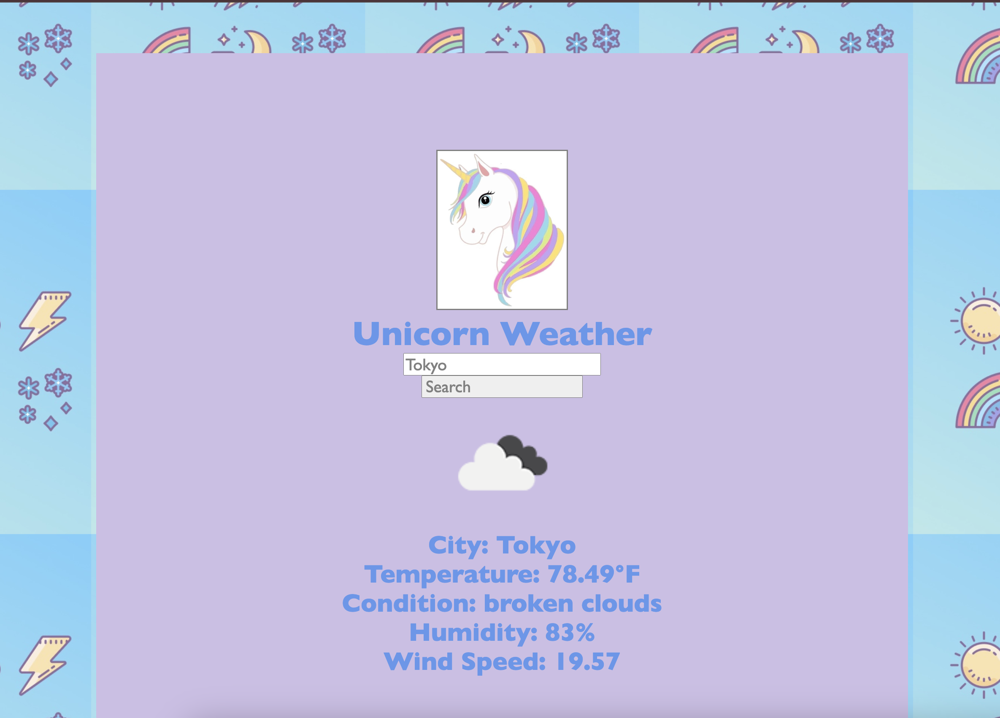

# Unicorn Weather App



## Overview
Tired of checking the weather and seeing the same boring, bland UI? The Unicorn Weather App adds a unique twist to a classic weather app. Created for those who love to add a little ✨razzle dazzle✨, this app fetches weather data (temperature, wind speed, etc.) from the OpenWeatherAPI for any city in the world and presents it in an interactive and responsive format using React and Node.js.

## Features
- **City-Based Weather Search**: Enter any city name to retrieve its current weather.
- **Detailed Weather Display**: View temperature, description, humidity, pressure, and wind speed.
- **Weather Icons**: Displays conditions with icons corresponding to the weather.
- **Responsive Design**: Built with React for a seamless, user-friendly experience.

## Technologies Used

**Frontend**:
- **React**: JavaScript library for building UI.
- **CSS**: For styling and layout.
- **Fetch API**: To request data from the backend.

**Backend**:
- **Express.js**: For setting up the server and handling requests.
- **Node.js**: JavaScript runtime environment for running the Express server.
- **CORS**: Middleware to handle Cross-Origin Resource Sharing.

**API**:
- **OpenWeatherMap API**: Provides weather data for cities worldwide.

## Installation

### Prerequisites
Ensure you have the following installed:
- **Node.js** (comes with npm): [Download Node.js](https://nodejs.org/)
- **Git** (for cloning the repository): [Download Git](https://git-scm.com/)

### Steps

1. **Clone the Repository**
   ```bash
   git clone https://github.com/ChasVanDav/techtonica-projects.git
   cd techtonica-projects/unicorn-weather-app

2. **Set Up the Backend**
   - Navigate to the backend folder (if applicable):
     ```bash
     cd unicorn-weather-app
     ```
   - Install backend dependencies:
     ```bash
     npm install
     ```
   - Start the server:
     ```bash
     npm start
     ```

3. **Set Up the Frontend**
   - Navigate to the `client` directory:
     ```bash
     cd client
     ```
   - Install frontend dependencies:
     ```bash
     npm install
     ```
   - Start the React development server:
     ```bash
     npm run dev
     ```

4. **Get an API Key**
   - Sign up on [OpenWeatherAPI](https://openweathermap.org/) and get an API key.
   - Create a `.env` file in the root directory and add your API key:
     ```plaintext
     REACT_APP_WEATHER_API_KEY=your_api_key_here
     ```

### API Endpoints

- **GET /** - Fetches weather data for a specified city.
  - **Query Parameter**: `city` (optional, defaults to "Honolulu").

## Stretch Goals
_(Additional features may be added in the future)_

## Contributing
For questions, comments, or contributions, please contact me via email or open an issue in this GitHub repository.

## License
This project is licensed under the MIT License.