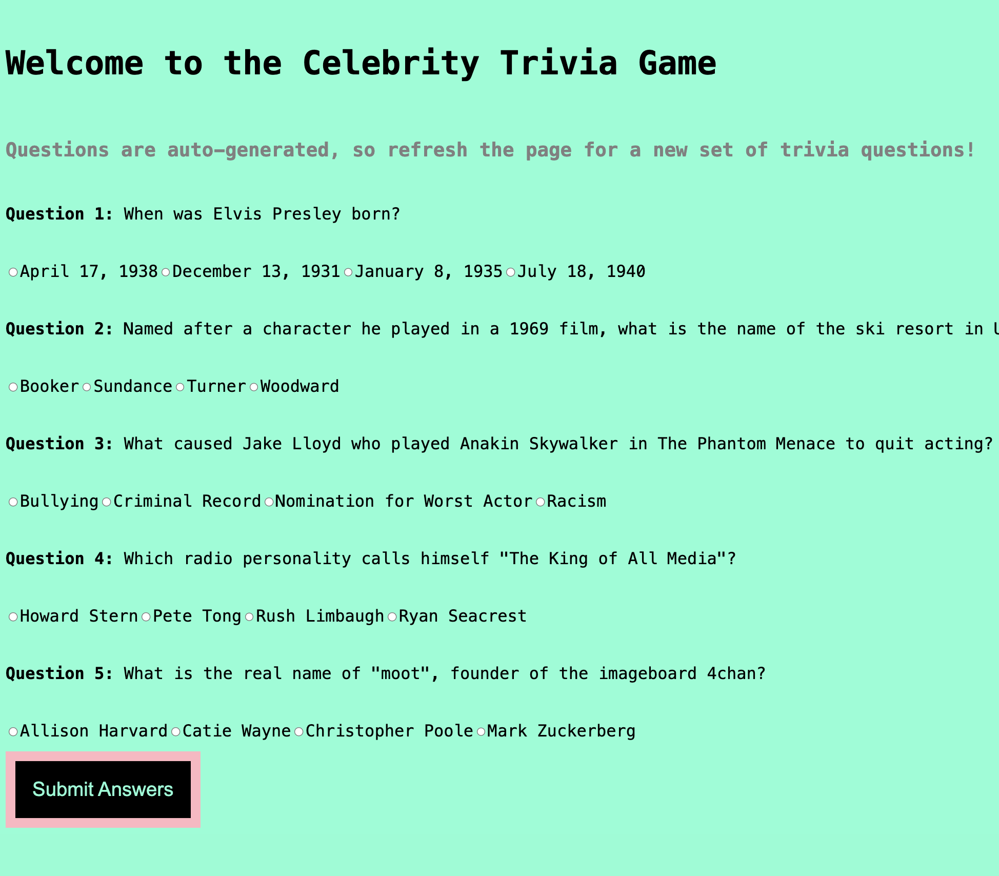

 🌟 Celebrity Trivia Quiz App 🌟



## Overview
Welcome to the **Celebrity Trivia Quiz App**! 🌟 Think you know everything about your favorite celebrities? From Hollywood stars to world-renowned athletes, this app is your chance to put that knowledge to the test! Featuring a fun and interactive quiz format, this app challenges users with questions on celebrity facts, achievements, and personal trivia. Dive in and see if you have what it takes to become the ultimate celebrity trivia master!

## Features
- **Randomized Questions**: Each quiz session offers a fresh mix of questions to keep things exciting.
- **Score Tracking**: Keep track of your progress and see how many questions you can answer correctly.
- **User-Friendly Interface**: Built with a sleek and responsive design, it’s perfect for mobile and desktop users alike.
- **Fast and Lightweight**: Powered by Vite for an optimized and speedy frontend experience.

## Tech Stack
- **Frontend**: React (with Vite for faster development)
- **Backend**: Express (Node.js) for server and API management
- **Styling**: CSS for a modern, clean look and responsive design

## Installation

Follow these steps to set up the Celebrity Trivia Quiz App on your local machine.

### Prerequisites
Make sure you have the following installed:
- **Node.js** (comes with npm): [Download Node.js](https://nodejs.org/)
- **Git** (for cloning the repository): [Download Git](https://git-scm.com/)

### Steps to Set Up Locally

1. **Clone the Repository**
   Clone the repository to your local machine and navigate to the project directory:
   ```
   git clone https://github.com/ChasVanDav/techtonica-projects.git
   cd techtonica-projects/8-quiz-app

2. **Install Backend Dependencies**
   Install the necessary packages for the backend:
   ```
   npm install

3. **Start the Express Server**  
   Start the server to handle the API and serve questions:  
   ```
   npm start

4. **Set Up the Frontend**
Open another terminal window, navigate to the `client` folder, install frontend dependencies, and start the React development server:

```
cd client
npm install
npm run dev

The frontend will run on http://localhost:3000 by default.

## Using the App
Once you’ve started both the backend and frontend servers:
1. Open [http://localhost:3000](http://localhost:3000) in your browser.
2. Start a quiz and try to answer as many questions as you can correctly!
3. Track your score and try to beat your previous best.

## API Endpoints
The backend API provides data for quiz questions.
- **GET /questions**: Returns a list of trivia questions related to celebrities.
  - **Parameters**: None (you may extend this with optional filters for categories or difficulty in the future).

## Future Enhancements
- **Additional Question Categories**: Expand the quiz with questions on different celebrity types (e.g., actors, musicians, athletes).
- **Difficulty Levels**: Allow users to select easy, medium, or hard questions.
- **Leaderboard**: Implement a global leaderboard to display top scores.

## Contributing
Contributions are welcome! To contribute:
1. Fork the repository.
2. Create a new branch (`git checkout -b feature/YourFeature`).
3. Make your changes and commit (`git commit -m 'Add a new feature'`).
4. Push to the branch (`git push origin feature/YourFeature`).
5. Open a pull request.

For any questions, comments, or suggestions, please reach out via GitHub or open an issue.

## License
This project is licensed under the MIT License.


