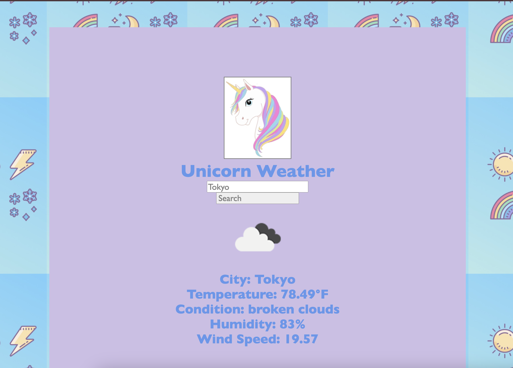

# Unicorn Weather App
via openweathermap.org api

Unicorn Weather App allows you to search for the current weather of any city around the world. 

You will get the following:

-Temperature (F)

-Condition description

-Humidity %

-Wind speed

Backend

-Express 

Frontend

-React 

-Vite

